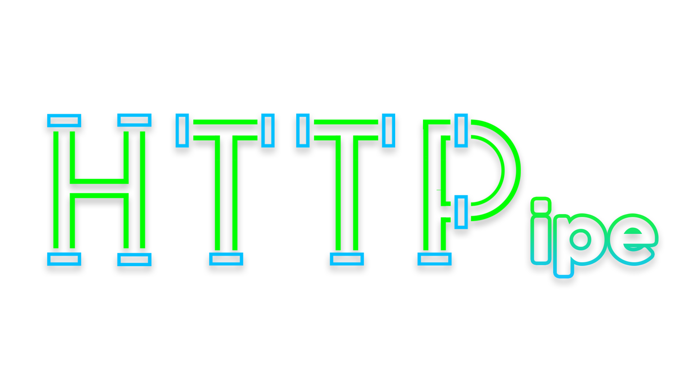

<div align="center" id="top"> 
  

  &#xa0;

</div>

<h1 align="center">Miletic_project_2</h1>

<p align="center">
  

  

  

  

  

</p>

<!-- Status -->

<h4 align="center"> 
	🚧  Miletic_project_2 🚀 Under construction...  🚧
</h4> 

<hr> -->

<p align="center">
  <a href="#dart-about">About</a> &#xa0; | &#xa0; 
  <a href="#sparkles-features">Features</a> &#xa0; | &#xa0;
  <a href="#rocket-technologies">Technologies</a> &#xa0; | &#xa0;
  <a href="#white_check_mark-requirements">Requirements</a> &#xa0; | &#xa0;
  <a href="#checkered_flag-starting">Starting</a> &#xa0; | &#xa0;
  <a href="#memo-license">License</a> &#xa0; | &#xa0;
  <a href="https://github.com/MarkoMZ" target="_blank">Author</a>
</p>

<br>

## :dart: About ##

The goal of this project is to implement an simple HTTP 1.1 Client that is able to download and upload files to a server.

HTTP-Basic Authentication should also be implemented.

This programm should be used via CLI.

But out of own interest i want to later add an GUI to get a better user expirience.

## :sparkles: Features ##

:heavy_check_mark: GET, POST, PUT, DELETE;\
:heavy_check_mark: Download files.;\
:heavy_check_mark: Commandline Usage;

## :rocket: Technologies ##

The following tools were used in this project:

- [C++]
- [Meson](https://mesonbuild.com/)
- [:books: spdlog](https://github.com/gabime/spdlog)
- [:books: asio](https://think-async.com/Asio)
- [:books: json](https://github.com/nlohmann/json)
- [:books: CLI11](https://github.com/CLIUtils/CLI11)

## :white_check_mark: Requirements ##

Before starting :checkered_flag:, you need to have all the Technologies mentioned above installed.

## :checkered_flag: Starting ##

```bash
# Clone this project
$ git clone https://github.com/MarkoMZ/miletic_project_2

# Access
$ cd miletic_project_2

# Go into /build
$ cd build

# Adjust the meson_options.txt => specify paths
# Required Libs are: CLI11, spdlog, nlohmann json, non-boost asio

# Build the project
$ meson ..

# Compile the project
$ ninja

# Execute
$ ./http_client -u [URI] -m [HTTP-Method]

```

## :triangular_flag_on_post: Flags ##
- u [URI]
- m [Method(GET; POST; PUT; DELETE)]
    - POST & PUT currently only support files.
- f [Path to File which should be sent via POST / PUT]
- a [HTTP-Basic Authentication User Data in the format[Username:Password]]
- d [Directory in which downloaded files should be saved]
- j [Authentication data in json format]
    ```json
    {
        username : "..."
        password : "..."
    }
    ```

## :memo: License ##

This project is under license from Boost. For more details, see the [LICENSE](LICENSE.md) file.

This project was made with :heart: by <a href="https://github.com/MarkoMZ" target="_blank">Marko Miletic</a>

&#xa0;

<a href="#top">Back to top</a>
